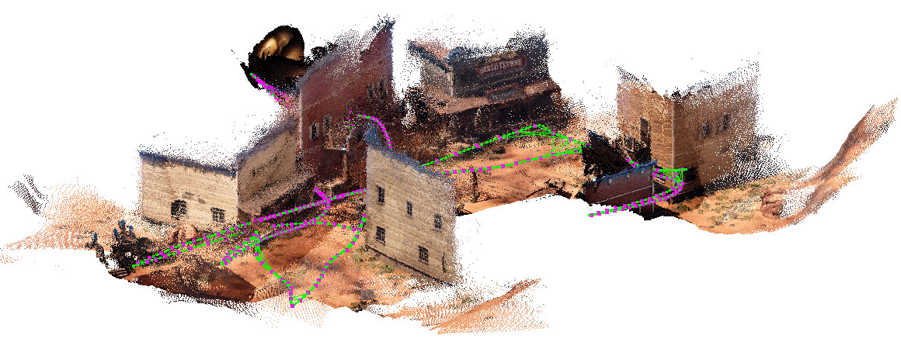
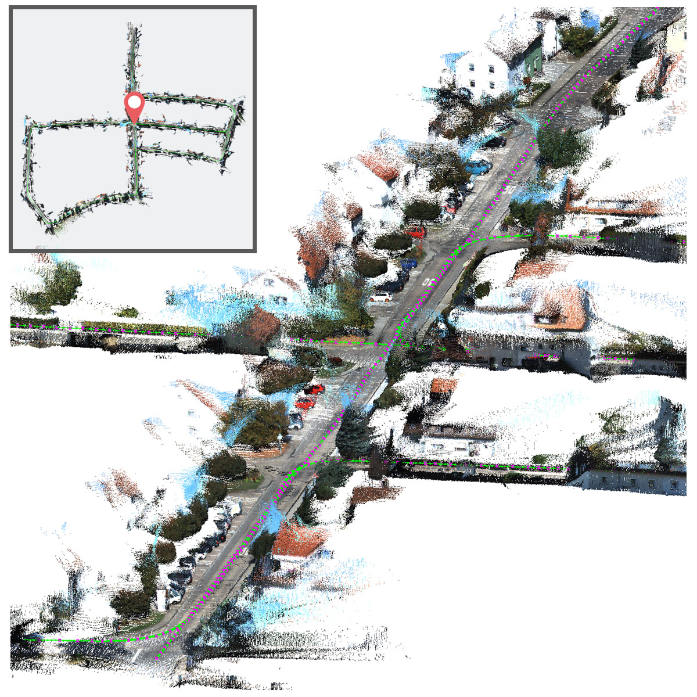

# **VOLDOR-SLAM**
Author: [Zhixiang Min](https://htkseason.github.io/)  
Contact: zmin1@stevens.edu  

VOLDOR-SLAM is a real-time dense-indirect SLAM system takes dense optical flows as input that supports monocular, stereo and RGB-D video sequence. The system logic is written in native python, which is friendly to modify and get started.  

 &nbsp; 

## **Related Pubulications**
> **VOLDOR-SLAM: For the times when feature-based or direct methods are not good enough**  
> Zhixiang Min, Enrique Dunn  
> ICRA 2021 [[paper]](https://arxiv.org/abs/2104.06800) [[video]](https://www.youtube.com/watch?v=sz8O953cXc0)

> **VOLDOR: Visual Odometry from Log-logistic Dense Optical flow Residuals**  
> Zhixiang Min, Yiding Yang, Enrique Dunn  
> CVPR 2020 [[paper]](https://arxiv.org/abs/2104.06789) [[video]](https://www.youtube.com/watch?v=wlWjSTiyE4s)

## **Installation**
Our system is built with cuda, cython and python. We will support the compatibility under the following configurations:  
> Windows 10 + Visual Studio 2017  &nbsp;/&nbsp;  Ubuntu 18.04  
> CUDA >= 9.0  
> Python 3.6.X  
> [OpenCV 3.4.X](https://opencv.org/)  
> [Ceres 2.0](http://ceres-solver.org/) &nbsp;&nbsp; (Optional for mapping)  
> [pyDBoW3](https://github.com/htkseason/pyDBoW3) &nbsp; (Optional for loop closure)  

### ***Python Packages***  

* Install the python package dependencies via pip.  
    ```bash  
    cd slam_py/install  
    pip install -r .\requirements.txt  
    ```

### ***Prebuilt Binaries***  
* For windows users, we provide [prebuilt binaries](https://drive.google.com/drive/folders/1kgFeY5JQ2iWVeDrpQ-Q-qR-F1aCu_vUk?usp=sharing). Download and copy the binaries files into the `demo` folder. You may also need install [VC++ runtime library](https://support.microsoft.com/en-us/topic/the-latest-supported-visual-c-downloads-2647da03-1eea-4433-9aff-95f26a218cc0).  

### ***Windows***

* **OpenCV (Required)**  
    1. Download and setup [OpenCV 3.4.X](https://opencv.org/releases/).  
    2. Copy `opencv_worldxxx.dll` from the opencv workspace to the `demo` folder.  

* **PyOpenGL (Optional for viewer)**  
    1. PyOpenGL installed from pip requires additional `dll` file to be configured in `PATH`. If you meet `OpenGL.error.NullFunctionError` while launching the viewer, try install PyOpenGL from wheels [PyOpenGL-wheels](https://www.lfd.uci.edu/~gohlke/pythonlibs/#pyopengl).  

* **Ceres (Optional for mapping)**  
    1. Download and follow the instructions to build [Ceres](http://ceres-solver.org/) with [SuiteSparse](https://github.com/jlblancoc/suitesparse-metis-for-windows). (Painful)  
    2. Copy `ceres.dll`, `glog.dll`, `libblas.dll`, `libgcc_s_sjlj-1.dll`, `libgfortran-3.dll`, `liblapack.dll`, `libquadmath-0.dll` to the `demo` folder. They are all ceres dependencies. You can find them under Ceres and SuiteSparse workspace.  

* **pyDBoW3 (Optional for loop closure. Prerequisite building full SLAM)**  
    1. Download and follow the instructions to build [pyDBoW3](https://github.com/htkseason/pyDBoW3). The library depends on boost and opencv. You will need to provide/change the library path in the build script.
    2. You will get `pyDBoW3.pyd` when you succeeded. Copy it to the `demo` folder.  
    3. The vocabulary file `ORBvoc.bin` already included in the `demo` folder.  

* **Build VO Only:**  
    1. Open and edit `slam_py/setup_win_vo.py`. You will need to provide/change `opencv_include_dir`, `opencv_lib_dir` and `opencv_lib_name` according to your opencv installation.  
    2. Run the following code to build.  
        ```bash
        cd slam_py/install  
        python setup_win_vo.py build_ext -i  
        ```
    3. If succeed, `gpu-kernels.dll` and `pyvoldor_vo.xxx.pyd` will appear in the `install` folder. Copy them to the `demo` folder.  
    
* **Build Full SLAM Pipeline:**  
    1. Open and edit `slam_py/setup_win_full.py`. You will need to provide/change `opencv_include_dir`, `opencv_lib_dir`, `opencv_lib_name`, `ceres_include_dirs` and `ceres_lib_dirs` according to your opencv and ceres installations.
    2. Run the following code to build. (No need building VO module first)  
        ```bash
        cd slam_py/install  
        python setup_win_full.py build_ext -i  
        ```
    3. If succeed, `gpu-kernels.dll` and `pyvoldor_full.xxx.pyd` will appear in the `install` folder. Copy them to the `demo` folder.


### ***Ubuntu***

* **OpenCV (Required)**  
    1. If using `sudo apt install libopencv-dev`, be aware of its version that we only tested under 3.4.X, though we found most versions work fine.  
    2. If build from source, remember running `sudo make install`.  

* **PyOpenGL (Optional for viewer)**
    1. `sudo apt install python-opengl`

* **Ceres (Optional for mapping)**  
    1. Build [Ceres](http://ceres-solver.org/) with SuiteSparse follow the instructions. Remember running `sudo make install`.  

* **pyDBoW3 (Optional for loop closure. Prerequisite building full SLAM)**  
    1. Download and follow the instructions to build [pyDBoW3](https://github.com/htkseason/pyDBoW3).
    2. You will get `pyDBoW3.so` when you succeed. Copy it to the `demo` folder.
    3. The vocabulary file `ORBvoc.bin` already included in the `demo` folder.  

* **Build VO Only:**  
    1. Run the following code to build.  
        ```bash
        cd slam_py/install  
        python setup_linux_vo.py build_ext -i
        ```
    2. If succeed, `libgpu-kernels.so` and `pyvoldor_vo.xxx.so` will appear in the `install` folder. Copy them to the `demo` folder.  
    
* **Build Full SLAM Pipeline:**  
    1. Run the following code to build. (No need building VO module first)  
        ```bash
        cd slam_py/install  
        python setup_linux_full.py build_ext -i
        ```
    2. If succeed, `libgpu-kernels.so` and `pyvoldor_full.xxx.so` will appear in the `install` folder. Copy them to the `demo` folder.  


## **Prepare Data**
Our method takes three inputs. You may download [demo data](https://drive.google.com/drive/folders/1kgFeY5JQ2iWVeDrpQ-Q-qR-F1aCu_vUk?usp=sharing) to run and play.  
> **Optical flows** are *REQUIRED* for visual odometry. We recommend [MaskFlowNet](https://github.com/microsoft/MaskFlownet) or [PWC-Net](https://github.com/sniklaus/pytorch-pwc) as the optical flow estimator.  
Supported format: `.flo`  

> **Disparity maps** are *OPTIONAL* input only present when stereo pairs or depth sensors are available. For stereo pairs, we recommend using the same optical flow estimator running from left to right. For depth sensors, you need to set a virtual baseline value to convert the depth to disparity as input.  
Supported format: `.flo`, `.png (x256 gray-16bit)`  

> **RGB images** are *OPTIONAL* input for adding photo-consistency to enhance the frame alignment.  
Supported format: `all image formats supported by opencv`  


## **Running**
```bash
cd demo
python demo.py --help
python demo.py 
--fx 320 --fy 320 --cx 320 --cy 240 --bf 80 
--flow_dir 'path_to_flow' 
--img_dir 'path_to_img' 
--disp_dir 'path_to_disp' 
--mode stereo 
--enable_mapping 
--enable_loop_closure './ORBvoc.bin' 
--save_poses './poses.txt' 
--save_depths './depths' 
```
More details can be found in the comments of the `demo` script. In [demo data](https://drive.google.com/drive/folders/1kgFeY5JQ2iWVeDrpQ-Q-qR-F1aCu_vUk?usp=sharing), we also provided bash commands in `run_demo.txt` under each data instance folder.  


## **Tips**
***Viewer Control Manual***  
<pre>
> q     ->   Exit  
> m     ->   Save point cloud to .ply  
> r     ->   Reset view  
> h     ->   Hide cameras / links  
> f     ->   Follow the current camera  
> w/s   ->   Increase/Decrease scene pixel size  
> d/a   ->   Increase/Decrease scene pixel density  
> x/z   ->   Increase/Decrease scene pixel depth range  
> Mouse scroll up/down         ->   Zoom in/out  
> Mouse drag with left down    ->   Scene rotation  
> Mouse drag with right down   ->   Scene translation  
</pre>

***Viewer Range.*** When running with monocular capture, if the world scale is unfortunately initialized too large, the viewer may not display many pixels, which can be adjusted using x/z keys.  

***How to pick basefocal.*** `basefocal` refers to `baseline (meter)` times `focal (px)`. It decides the scene scale. If the input disparity maps are from rectified stereo, the `baseline` of stereo pairs should be used. In the case of depth camera or monocular, `basefocal` can be used as a hyper-parameter tuning the confidence on the input depth. A proper `basefocal` value should let the displayed keyframe depth map (`tmpkf_depth`) shows a porper variance (neither pure white or black).  

***Input Frame Rate.*** Our framework favors a modest baseline between frames to let the optical flows being informative. For high frame rate videos, consider downsampling the frame rate based on appearance changing. (E.g. KITTI/TartanAir @ 10Hz, TUM-RGBD @ 3Hz.)  

***I/O BottleNeck.*** If you observe choppy GPU load or the latest map on the viewer colored gray, it probably means the disk I/O is bottlenecking the performance. This will affect the accuracy by blocking the local mapping while VO keeps running. Consider move your data to SSD disk or you may restart the software a few times that your disk will cache more data.  

***Parameter Tuning.*** Usually default parameters work for all. You may try loosing the loop closure thresholds to detect more loop closures. For very challenging dataset, if the full pipeline is not stable, try disable local mapping. For tuning VO parameters, pass parameters using `slam.voldor_user_config`. All available parameters can be found in `voldor/config.h` with descriptions. For SLAM parameters, check the `__init__` method of `VOLDOR_SLAM`.  

***What is mono-scaled mode?*** Mono-scaled mode is to use the disparity map only for correcting the world scale.  

## **License & Third Party Acknowledgements**
The software is released under the attached `LICENSE` file.  
Parts of the software rely on the following open source projects:  
[LambdaTwist](https://github.com/midjji/lambdatwist-p3p), [OpenCV](https://github.com/opencv/opencv), [pyDBoW3](https://github.com/foxis/pyDBoW3), [DBoW3](https://github.com/rmsalinas/DBow3), [Ceres](https://github.com/ceres-solver/ceres-solver), [SuiteSparse](https://github.com/jlblancoc/suitesparse-metis-for-windows), [Eigen](https://gitlab.com/libeigen/eigen), [svd3](https://github.com/ericjang/svd3), [PyOpenGL](https://github.com/mcfletch/pyopengl)